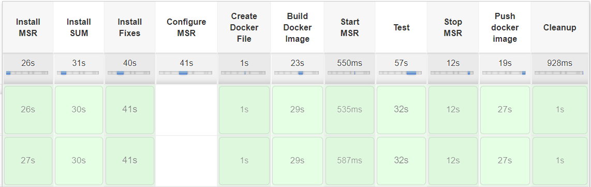

## Work in progess ..

# Microservices Runtime  with Docker/Jenkins

This project allows user to perform the following steps using the Jenkins pipeline

1. Install SoftwareAG Microservices Runtime
2. Install update manager 
3. Install fixes
4. Configure Mircoservices Runtime
5. Create Docker image from installed and configured Mircoservices Runtime
6. Run tests against the Docker container started using the Docker image created above
7. Push the created Docker image into Docker registry

## Getting Started
### Prerequisites

It is required that you have installed Docker and Jenkins in your environment.
 
**Note:** If above softwares are already installed, skip to "Setup" section. These samples are validated on RHEL and CentOS.

### Installing Docker

Follow the steps below to install Docker in your environment.

Install Docker:
```
sudo yum install docker
```

First remove older version of docker (if any):
```
sudo yum remove docker docker-common docker-selinux docker-engine-selinux docker-engine docker-ce
```

Install required packages
```
sudo yum install -y yum-utils device-mapper-persistent-data lvm2
```

Configure the docker-ce repo
```
sudo yum-config-manager --add-repo https://download.docker.com/linux/centos/docker-ce.repo
```

Install docker-ce
```
sudo yum install docker-ce
```

Start Docker
```
sudo systemctl start docker 

or 

sudo service docker start
```

### Installing Jenkins

Follow the steps below to install Jenkins in your environment.

Add the Jenkins repository to the yum repos, and install Jenkins from here.
```
sudo wget -O /etc/yum.repos.d/jenkins.repo http://pkg.jenkins-ci.org/redhat/jenkins.repo
sudo rpm --import https://jenkins-ci.org/redhat/jenkins-ci.org.key
sudo yum install jenkins
```

Jenkins requires Java in order to run, yet certain distros don't include this by default. To install the Open Java Development Kit (OpenJDK) run the following:
```
sudo yum install java
```

Start Jenkins
```
sudo service jenkins start
```

**Note:** Make sure port 8080 is accessible on the machine. You can use the following command to make port 8080 available.
```
sudo iptables -I INPUT 1 -p tcp --dport 8080 -j ACCEPT
```

Launch Jenkins as below and follow instructions in browser to change password and set up account
```
http://localhost:8080
```

### Setup

Login to Docker (Reference - https://docs.docker.com/engine/reference/commandline/login/)
```
sudo docker login -u [username] 
```

**Note:** Jenkins requires sudo permissions to run docker commands

Follow the steps below to provide sudo access to run docker from Jenkins

Open the file sudoers
```
sudo vi /etc/sudoers 
```

Add below line to the file
```
jenkins ALL=(ALL) NOPASSWD: ALL
```

## To install and run the sample

1. Create directory /opt/softwareag in your environment. This is the default directory, you can set it to any other value. Please ensure to use this directory in the Jenkins job.

2.	Clone the webmethods-microservicesruntime-samples repository. <br/>
`git clone https://github.com/SoftwareAG/webmethods-microservicesruntime-samples.git`

3.	Go to the resources directory of the repository. <br/>
`cd webmethods-microservicesruntime-samples/docker/jenkins/resources`

4. Copy your license file(licenseKey.xml) into resources folder.

5. Download Software AG Installer(.bin) file for Linux from https://empower.softwareag.com/Products/DownloadProducts/sdc/default.aspx into resources folder

6. Download Software AG Update Manager Installer for Linux from https://empower.softwareag.com/Products/DownloadProducts/sdc/default.aspx into resources folder

7. This step is required for supplying password to Update Manager. 

Install SoftwareAGUpdateManagerInstaller20190930(LinuxX86).bin (version- 10.3) in any desired location (lets say /opt/softwareag/sagsum103)

   ```
   sudo ./"SoftwareAGUpdateManagerInstaller20190930(LinuxX86).bin" --accept-license -d /opt/softwareag/sagsum103
   ```

   Execute UpdateManagerCMD.sh from  /opt/softwareag/sagsum103/bin
   
   Select option 9. Password Encryption, type Empower password to encrypt the password 
   
   Copy the encrypted password(lets say "abcdefgh") and replace empowerPwd as below format in sum.txt (if you follow above steps you would find sum.txt under /opt/softwareag/resources)
   * empowerPwd=abcdefgh

8. If jenkins is installed, copy 'webmethods-microservicesruntime-samples/docker/jenkins/MSR_Docker' folder into '/var/lib/jenkins/jobs' and execute following command to grant access permission

  ```
  sudo chmod 777 /var/lib/jenkins/jobs/MSR_Docker  -R
  ```

  Restart the jenkins
   ```
   sudo service jenkins restart
   ```
   
9. Login to Jenkins dashboard (http://localhost:8080) and click on "MSR_Docker" job.

10. Click "Build with Parameters" from the options in the left, provide valid parameters and click build. If everything is successful, you will see your Docker image published into the Docker registry.
   


## Jenkins Pipeline stages
Jenkins job has multiple stages in the pipeline.

##### Install MSR  
  Installs the MSR based on the parameters specified for installer Configurations.

##### Install SUM  
 Installs Update Manager that can be used to install latest fixes.

##### Install Fixes
 Installs all the fixes to the installed MSR.

##### Configure MSR
 This step is conditional. If APPLY_CONFIGURATION is set to YES then based on supplied ACDL configuration files, the configurations will be applied to the installed MSR.

##### Create Docker File
 Creates Docker file for the installed MSR with latest fixes and applied configurations.

##### Build Docker Image
 Builds docker image from docker file created from previous step.

##### Start MSR
 Starts MSR in a Docker container.

##### Test
This stage allows to execute any tests on the Docker container.

##### Stop MSR
Stops the running Docker container.

##### Push docker image
Push the docker image into specified Docker registry with the tag specified.

##### Cleanup
Clean up the environment such as removing containers and images.


## Jenkins Parameters 
| Parameter               	| Description                                                                                                              	| Default                                                  	| Possible Values                                          	| Required                      	|
|-------------------------	|--------------------------------------------------------------------------------------------------------------------------	|----------------------------------------------------------	|----------------------------------------------------------	|-------------------------------	|
| SAG_DIR                 	| Directory to store resources such as SAG installer bin, SAG installer script, license key file, SUM script, test script. 	| /opt/softwareag/resources                                	|                                                          	| Yes                           	|
| INSTALL_FIXES            	| Installs fixes if set to YES                                                                              	| YES                                                       	|                                                          	| Yes                           	|
| APPLY_CONFIGURATION      	| Applies configuration if set to YES                                                                               	| NO                                                      	|                                                          	| Yes                           	|
| SAG_EMPOWER_USERNAME    	| Empower Username                                                                                                         	|                                                          	|                                                          	| Yes                           	|
| SAG_EMPOWER_PASSWORD    	| Empower Password                                                                                                         	|                                                          	|                                                          	| Yes                           	|
| SAG_INSTALLER_BIN       	| SAG installer bin file name                                                                                              	| SoftwareAGInstaller-Linux_x86_64.bin                     	|                                                          	| Yes                           	|
| SAG_INSTALLER_SCRIPT    	| SAG installer script file name                                                                                           	| msrInstallerLinuxScript_10_5.txt                         	| msrInstallerLinuxScript_10_5.txt                         	| Yes                           	|
|                         	|                                                                                                                          	|                                                          	| msrInstallerLinuxScript_10_3.txt                         	|                               	|
| SAG_INSTALLER_SANDBOX   	| Sandbox URL                                                                                                              	| https://sdc.softwareag.com/cgi-bin/dataservewebM105.cgi 	| https://sdc.softwareag.com/cgi-bin/dataservewebM105.cgi 	| Yes                           	|
|                         	|                                                                                                                          	|                                                          	| https://sdc.softwareag.com/cgi-bin/dataservewebM103.cgi 	|                               	|
| SAG_MSR_DIR             	| MSR installation directory                                                                                               	| /opt/softwareag/msr                                      	|                                                          	| Yes                           	|
| SAG_MSR_LICENSE_FILE    	| license file name                                                                                                        	| licenseKey.xml                                           	|                                                          	| Yes                           	|
| SAG_MSR_DEFAULT_PORT    	| MSR default port                                                                                                         	| 5555                                                     	|                                                          	| Yes                           	|
| SAG_MSR_DIAGNOSTIC_PORT 	| MSR diagnostic port                                                                                                      	| 9999                                                     	|                                                          	| Yes                           	|
| SAG_SUM_INSTALLER_BIN   	| SAG update manager installer bin file name                                                                               	| SoftwareAGUpdateManagerInstaller20191101(LinuxX86).bin   	| SoftwareAGUpdateManagerInstaller20191101(LinuxX86).bin   	| Yes                           	|
|                         	|                                                                                                                          	|                                                          	| SoftwareAGUpdateManagerInstaller20190930(LinuxX86).bin   	|                               	|
| SAG_SUM_DIR             	| SUM installed directory                                                                                                  	| /opt/softwareag/sagsum                                   	|                                                          	| Yes                           	|
| SAG_SUM_SCRIPT          	| SUM update manager script file name                                                                                      	| sum.txt                                                  	|                                                          	| Yes                           	|
| ACDL_FILE               	| ACDL filename to configure MSR                                                                                           	| isconfiguration.acdl                                     	|                                                          	| Depends on APPLY_CONFIGURATION 	|
| ACDL_BIN_FILE           	| ACDL package (.zip) filename to configure MSR                                                                            	| isconfiguration.zip                                      	|                                                          	| Depends on APPLY_CONFIGURATION 	|
| SAG_TEST_SCRIPT         	| Test script file name                                                                                                    	| test.sh                                                  	|                                                          	| Yes                           	|
| DOCKER_REPO_URL         	| Docker Repository                                                                                                        	|                                                          	|                                                          	| Yes                           	|
| DOCKER_TAG              	| Docker Tag                                                                                                               	| 10.5.0.2                                                 	|                                                          	| Yes                           	|
| DOCKER_BASE_IMAGE_NAME  	| Docker image name                                                                                                        	| centos:7                                                 	|                                                          	| Yes                           	|                                                  

## Examples
### Jenkins Parameters for Microservices Runtime 10.5 

   
| Parmeters               	| Values                                                            	|
|-------------------------	|-------------------------------------------------------------------	|
| SAG_DIR                 	| /opt/softwareag/resources                                         	|
| INSTALL_FIXES                	| YES                                                                	|
| APPLY_CONFIGURATION      	| NO                                                               	|
| SAG_EMPOWER_USERNAME    	| empower username                                                  	|
| SAG_EMPOWER_PASSWORD    	| empower password                                                  	|
| SAG_INSTALLER_BIN       	| ${SAG_DIR}/SoftwareAGInstaller20191216-LinuxX86.bin               	|
| SAG_INSTALLER_SCRIPT    	| ${SAG_DIR}/msrInstallerLinuxScript_10_5.txt                       	|
| SAG_INSTALLER_SANDBOX   	| https://sdc.softwareag.com/cgi-bin/dataservewebM105.cgi          	|
| SAG_MSR_DIR             	| /opt/softwareag/msr                                               	|
| SAG_MSR_LICENSE_FILE    	| ${SAG_DIR}/licenseKey.xml                                         	|
| SAG_MSR_DEFAULT_PORT    	| 5555                                                              	|
| SAG_MSR_DIAGNOSTIC_PORT 	| 9999                                                              	|
| SAG_SUM_INSTALLER_BIN   	| ${SAG_DIR}/SoftwareAGUpdateManagerInstaller20191101(LinuxX86).bin 	|
| SAG_SUM_DIR             	| /opt/softwareag/sagsum                                            	|
| SAG_SUM_SCRIPT          	| ${SAG_DIR}/sum.txt                                                	|
| ACDL_FILE               	| ${SAG_DIR}/isconfiguration.acdl                                   	|
| ACDL_BIN_FILE           	| ${SAG_DIR}/isconfiguration.zip                                    	|
| SAG_TEST_SCRIPT         	| ${SAG_DIR}/test.sh                                                	|
| DOCKER_REPO_URL         	| docker hub url                                                    	|
| DOCKER_TAG              	| 10.5.0.2                                                          	|
| DOCKER_BASE_IMAGE_NAME  	| centos:7                                                          	|

### Jenkins Parameters for Microservices Runtime 10.3

   
| Parmeters               	| Values                                                            	|
|-------------------------	|-------------------------------------------------------------------	|
| SAG_DIR                 	| /opt/softwareag/resources                                         	|
| INSTALL_FIXES                	| YES                                                               	|
| APPLY_CONFIGURATION      	| NO                                                               	|
| SAG_EMPOWER_USERNAME    	| empower username                                                  	|
| SAG_EMPOWER_PASSWORD    	| empower password                                                  	|
| SAG_INSTALLER_BIN       	| ${SAG_DIR}/SoftwareAGInstaller20191216-LinuxX86.bin               	|
| SAG_INSTALLER_SCRIPT    	| ${SAG_DIR}/msrInstallerLinuxScript_10_3.txt                       	|
| SAG_INSTALLER_SANDBOX   	| https\://sdc.softwareag.com/cgi-bin/dataservewebM105.cgi          	|
| SAG_MSR_DIR             	| /opt/softwareag/msr                                               	|
| SAG_MSR_LICENSE_FILE    	| ${SAG_DIR}/licenseKey.xml                                         	|
| SAG_MSR_DEFAULT_PORT    	| 5555                                                              	|
| SAG_MSR_DIAGNOSTIC_PORT 	| 9999                                                              	|
| SAG_SUM_INSTALLER_BIN   	| ${SAG_DIR}/SoftwareAGUpdateManagerInstaller20190930(LinuxX86).bin 	|
| SAG_SUM_DIR             	| /opt/softwareag/sagsum                                            	|
| SAG_SUM_SCRIPT          	| ${SAG_DIR}/sum.txt                                                	|
| ACDL_FILE               	| ${SAG_DIR}/isconfiguration.acdl                                   	|
| ACDL_BIN_FILE           	| ${SAG_DIR}/isconfiguration.zip                                    	|
| SAG_TEST_SCRIPT         	| ${SAG_DIR}/test.sh                                                	|
| DOCKER_REPO_URL         	| docker hub url                                                    	|
| DOCKER_TAG              	| 10.3.0.9                                                        	|
| DOCKER_BASE_IMAGE_NAME  	| centos:7                                                          	|

## Create Install Script for Microservices Runtime  
This sample provides default install script - msrInstallerLinuxScript_10_3.txt and msrInstallerLinuxScript_10_5.txt. 

To create install script( SAG_INSTALLER_SCRIPT  parameter) for Microservices Runtime from SAG Installer follow the steps in below links

* 10.5 - https://documentation.softwareag.com/a_installer_and_update_manager/10-5_Software_AG_Installer_webhelp/index.html#page/using-sag-installer-webhelp/to-console_mode_18.html
* 10.3  -  https://documentation.softwareag.com/a_installer_and_update_manager/10-3_Software_AG_Installer_webhelp/index.html#page/using-sag-installer-webhelp/to-console_mode_17.html

## License

This project uses the Apache License Version 2.0. For details, see [the license file](../../LICENSE).

For more information about Microservices Runtime, see the official Software AG Microservices Runtime documentation.

______________________
These tools are provided as-is and without warranty or support. They do not constitute part of the Software AG product suite. Users are free to use, fork and modify them, subject to the license agreement. While Software AG welcomes contributions, we cannot guarantee to include every contribution in the master project.	

Contact us at [TECHcommunity](mailto:technologycommunity@softwareag.com?subject=Github/SoftwareAG) if you have any questions.
