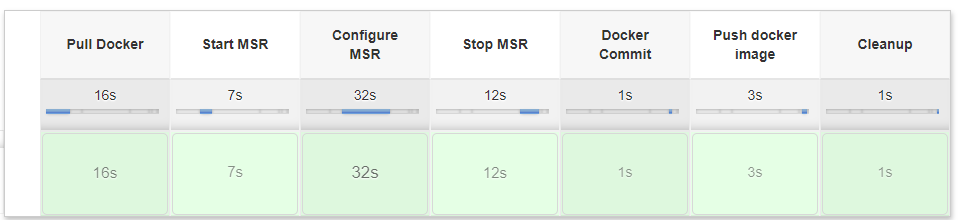

# Microservices Runtime with DockerHub/Jenkins

This project allows user to perform the following steps using the Jenkins pipeline

1. Pull Docker image of Microservices Runtime from Dockerhub
2. Configure Mircoservices Runtime
3. Create Docker image from configured Mircoservices Runtime
4. Run tests against the Docker container started using the Docker image created above
5. Push the created Docker image into Docker registry

## To install and run the sample


1. Create directory /opt/softwareag in your environment. This is the default directory, you can set it to any other value. Please ensure to use this directory in the Jenkins job.

2.	Clone the webmethods-microservicesruntime-samples repository. <br/>
    ```
    git clone https://github.com/SoftwareAG/webmethods-microservicesruntime-samples.git
    ```

3. If jenkins is installed, copy 'webmethods-microservicesruntime-samples/docker/jenkins/MSR_DockerHub' folder into '/var/lib/jenkins/jobs' and execute following command to grant access permission

      ```
      sudo chmod 777 /var/lib/jenkins/jobs/MSR_DockerHub  -R
      ```

    Restart the jenkins
    ```
    sudo service jenkins restart
    ```

4. Optionally, if you need to configure Microservices runtime, copy isconfiguration.acdl and isconfiguration.zip files into 'webmethods-microservicesruntime-samples/docker/jenkins/resources` i.e. *resources* folder.

5. Login to Jenkins dashboard (http://localhost:8080) and click on "MSR_DockerHub" job.

6. Click "Build with Parameters" from the options in the left, provide valid parameters and click build. If everything is successful, you will see your Docker image published into the Docker registry with provided configuration.
   

   
## Jenkins Pipeline stages
##### Pull Docker  
  Pulls the Docker image from the given Docker repository

##### Start MSR
 Starts the MSR in port 5555 within the  docker container 

##### Configure MSR
 Configures the MSR with given configuration files. To create configuration files refer [Create configuration files](https://github.com/SoftwareAG/webmethods-microservicesruntime-samples/tree/master/docker/jenkins#create-configuration-files)

##### Stop MSR
 Stop the running container

#####  Docker Commit 
 Commits the Configured Docker image with new tag

##### Push docker image
Push the Configured Docker image into specified Docker hub URL

##### Cleanup
Clean up the environment such as removing containers and images.

## Jenkins Parameters 
| Parameter            	| Description                                                                                   	| Default                   	| Required 	|
|----------------------	|-----------------------------------------------------------------------------------------------	|---------------------------	|----------	|
| SAG_DIR              	| Directory to store resources such as isconfiguration.acdl, isconfiguration.zip, wm-deploy.jar 	| /opt/softwareag/resources 	| Yes      	|
| DOCKER_REPO_URL      	| Docker Repository                                                                             	|                           	| Yes      	|
| DOCKER_TAG           	| Docker Tag                                                                                    	|                           	| Yes      	|
| SAG_MSR_DEFAULT_PORT 	| MSR default port                                                                              	| 5555                      	| Yes      	|
| ACDL_FILE            	| ACDL filename to configure MSR                                                                	| isconfiguration.acdl      	| Yes      	|
| ACDL_BIN_FILE        	| ACDL package (.zip) filename to configure MSR                                                 	| isconfiguration.zip       	| Yes      	|
| DOCKER_COMMIT_TAG    	| Docker Commit Tag                                                                             	|                           	| Yes      	|         
## Examples
### Jenkins Parameters for Software AG Microservices Runtime 10.5.0.0 

| Parmeters            	| Values                                           	|
|----------------------	|--------------------------------------------------	|
| SAG_DIR              	| /opt/softwareag/resources                        	|
| DOCKER_REPO_URL      	| store/softwareag/webmethods-microservicesruntime 	|
| DOCKER_TAG           	| 10.5.0.0                                         	|
| SAG_MSR_DEFAULT_PORT 	| 5555                                             	|
| ACDL_FILE            	| ${SAG_DIR}/isconfiguration.acdl                  	|
| ACDL_BIN_FILE        	| ${SAG_DIR}/isconfiguration.zip                   	|
| DOCKER_COMMIT_TAG           	| 10.5.0.0_1                                       	|


## License

This project uses the Apache License Version 2.0. For details, see [the license file](../../LICENSE).

For more information about Microservices Runtime, see the official Software AG Microservices Runtime documentation.

______________________
These tools are provided as-is and without warranty or support. They do not constitute part of the Software AG product suite. Users are free to use, fork and modify them, subject to the license agreement. While Software AG welcomes contributions, we cannot guarantee to include every contribution in the master project.	

Contact us at [TECHcommunity](mailto:technologycommunity@softwareag.com?subject=Github/SoftwareAG) if you have any questions.

