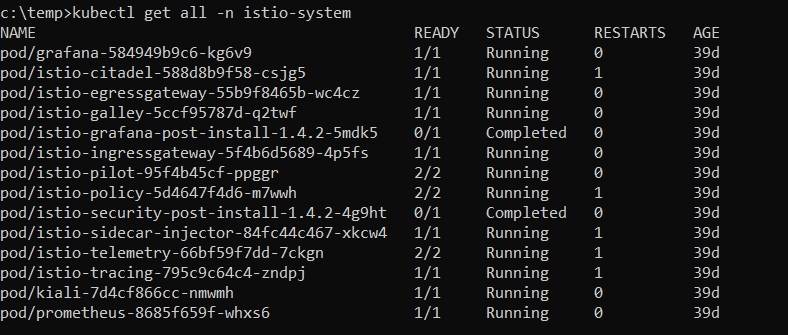
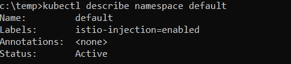

# Istalling Istio

> Adapted from the [Istio Quick Start](https://istio.io/docs/setup/)

## 1. Deploy Istio

You can skip this step, if you have already installed Istio in your environment. If Istio is not provisioned in your Kubernetes environment, follow the steps below for the installation of Istio. 

Install custom resource definitions ([istio-crds.yaml](./istio-crds.yaml)):

```
kubectl apply -f istio-crds.yaml
```

Install demo configuration ([istio-demo.yaml](./istio-demo.yaml)):

```
kubectl apply -f istio-demo.yaml
```

## 2. Verify Istio

Once Istio is installed, follow the steps below to ensure Istio r
Verify Running :

```
kubectl get all -n istio-system
```


## 3. Configure auto proxy injection

This step enables Istio as a sidecar for PODS that are started in a default namespace 

Configure default namespace:

```
kubectl label namespace default istio-injection=enabled
```

Check label:

```
kubectl describe namespace default
```


## 4. Check running pods and services

```
kubectl get all
```
