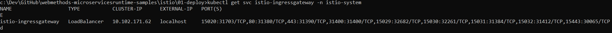

# Deploying BookInfo App managed by Istio
Steps described here deploys BookInfo App that is created using webMethods Microservices Runtime. 

There are four packages in this application. Each package is deployed as a Microservice. 

1. BookInfoDetails, BookInfoRatings, BookInfoReviews packages are created by importing Swagger files provided for BookInfoApp. These packages contain REST API Descriptor that provides services for each of the operations described in Swagger file.

2. BookInfoApp package orchestrates all the above services using Swagger Consumer capability in webMethods Microservices Runtime.

3. Swagger file for each of the package is under resources folder in the package.

Packages used in the Docker images are located under [packages](../packages) directory. 


## 1. Deploy BookInfo

Base Docker image for webMethods Microservices Runtime can be downloaded from [Dockerhub](https://hub.docker.com/_/softwareag-webmethods-microservicesruntime).

Optionally, you can also create Docker images with the packages above from installed webMethods Microservices Runtime. [How to create Docker image](http://techcommunity.softwareag.com/pwiki/-/wiki/Main/Getting%20started%20with%20webMethods%20Microservices%20Runtime%20with%20Docker) provides more information about this.

These samples utilizes pre-built Docker images. If you create Docker images of your own, update deployment [template](bookinfo-v1.yaml).

Deploy BookInfo Application
```
kubectl apply -f bookinfo-v1.yaml
```
Apply ingress gateway to access /WmRoot, /invoke endpoints. Notice use of Istio for ingress gateway in the [template](bookinfo-gateway.yaml).
```
kubectl apply -f bookinfo-gateway.yaml
```

## 2. Verify the install

Check pods:

```
kubectl get pods
```


Check gateway:

```
kubectl get svc istio-ingressgateway -n istio-system
```


To ensure application is successfully deployed, login to the application using default Administrator userid.

> Browse to http://localhost/WmRoot

 

> Execute [http://localhost/invoke/bookApp:getProductDetails?id=1](http://localhost/invoke/bookApp:getProductDetails?id=1)
> Valid values for id is 1 or 2 or 3. Any other values can be considered as an unknown.

Observe the response returned by the above execution. Alternatively, you can use tools like Postman to execute the request. 


