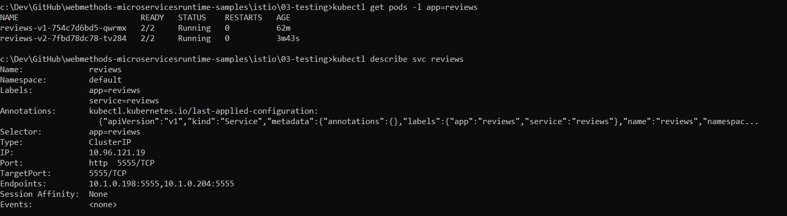

# Launch version v2 of reviews service

This sample launches new version of reviews service. When new version for reviews service is launched, traffic is routed by default between version v1 and version v2 of reviews service.

## 1. Deploy v2 of reviews service

Version of the service is controlled by passing an ENV variable - **SERVICE_VERSION** in yaml [template](reviews-v2.yaml).

```
kubectl apply -f reviews-v2.yaml
```

Check deployment:

```
kubectl get pods -l app=reviews

kubectl describe svc reviews
```


> Browse to http://localhost/invoke/bookApp:getProductDetails?id=1 and refresh, requests load-balanced between v1 and v2. This is reflected in text field in Product Reviews's Version field.
