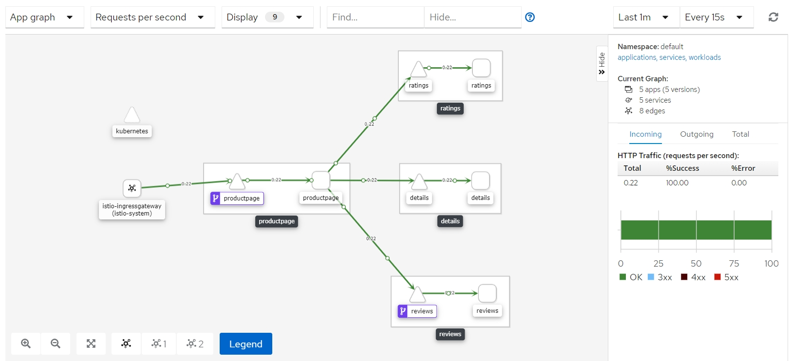

# Visualizing the Service Mesh

This sample describes, how we can use [Kiali](https://kiali.io) to graph active services and see the traffic flow between them.

## 1. Publish the Kiali Dashboard

Deploy a [Gateway and VirtualService](kiali.yaml) for Kiali:

```
kubectl apply -f kiali.yaml
```

> Browse to http://localhost:15029, sign in with `admin`/`admin`

Check Service Graph in Kiali Dashboard. 

