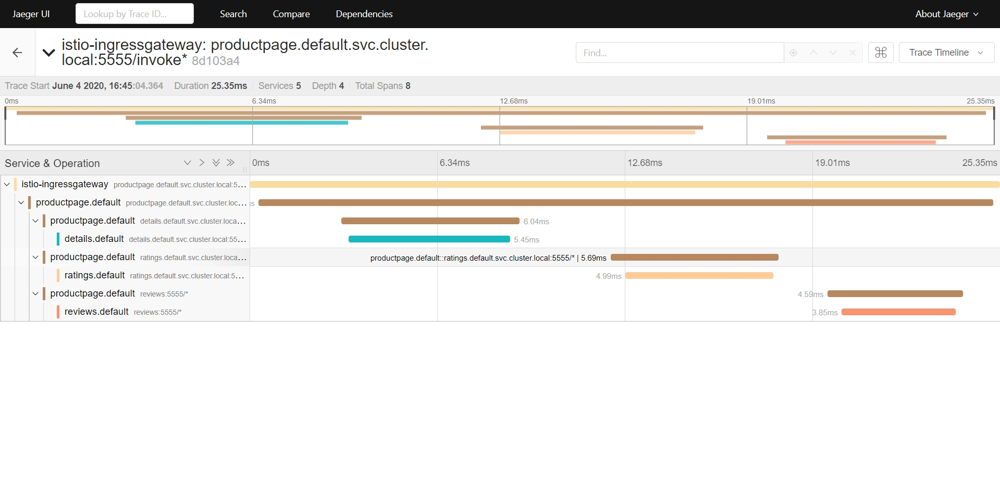
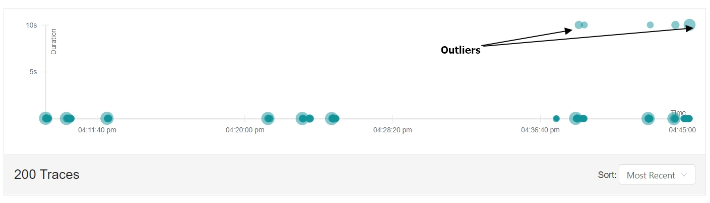

# Distributed Tracing

This sample describes how to use [Jaegar](https://www.jaegertracing.io) to visualize trace spans and investigate outliers. 

## 1. Publish the Jaegar UI

Deploy a [Gateway and VirtualService](jaegar.yaml) for Jaegar:

```
kubectl apply -f jaegar.yaml
```

> Browse to http://localhost:15032 

- Select service `productpage.default`and view the details about spans. 
- webMethods Microservices Runtime provides extended settings that allows transmitting headers required for open tracing. 
>**watt.server.http.forwardableHeaders**=x-request-id,x-b3-traceid,x-b3-spanid,x-b3-parentspanid,x-b3-sampled,x-b3-flags,x-ot-span-context
>If the above property is not set in your Docker image, you will not be able to view detailed spans.



## 2. Add service latency

Template [product page](productpage-delay.yaml) adds 10s delays using Istio.

```
kubectl apply -f productpage-delay.yaml
```

> Browse to http://localhost/invoke/bookApp:getProductDetails?id=1 and refresh many times, for 5% of the traffic delay of 10 second is added. 

> Browse to http://localhost:15032 and check for outliers in the graph that gets displayed on the top.

