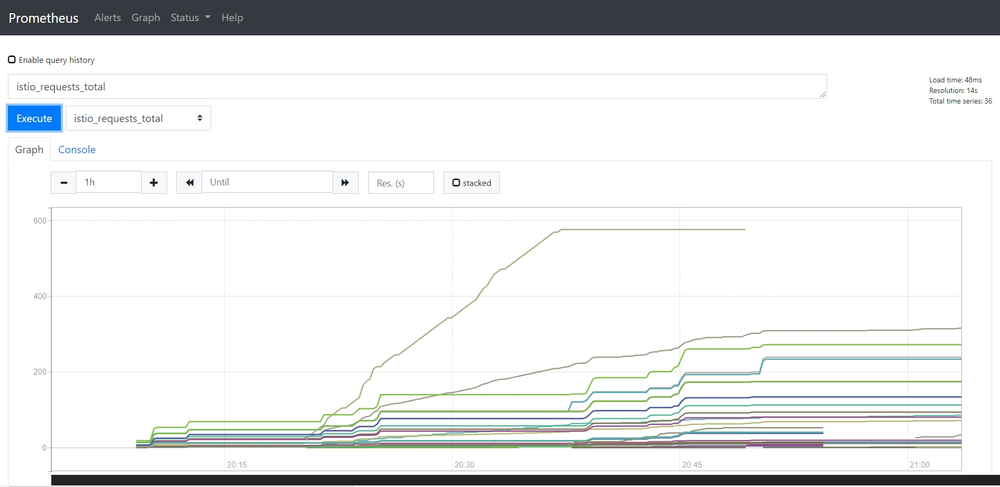

# Monitoring with Prometheus & Grafana

See the metrics coming into [Prometheus](https://prometheus.io) and the Istio dashboards in [Grafana](https://grafana.com) through Istio.

## 1. Publish the Prometheus UI

Deploy a [Gateway and VirtualService](prometheus.yaml) for Prometheus:

```
kubectl apply -f prometheus.yaml
```

> Browse to http://localhost:15030

- Select `istio_requests_total`
- Switch to _Graph_



## 2. Publish the Grafana UI

Deploy a [Gateway and VirtualService](grafana.yaml) for Grafana:

```
kubectl apply -f grafana.yaml
```

> Browse to http://localhost:15031

 - View _Istio Mesh Dashboard_ 
 
 
 
 - View _Istio Service Dashboard_
 
