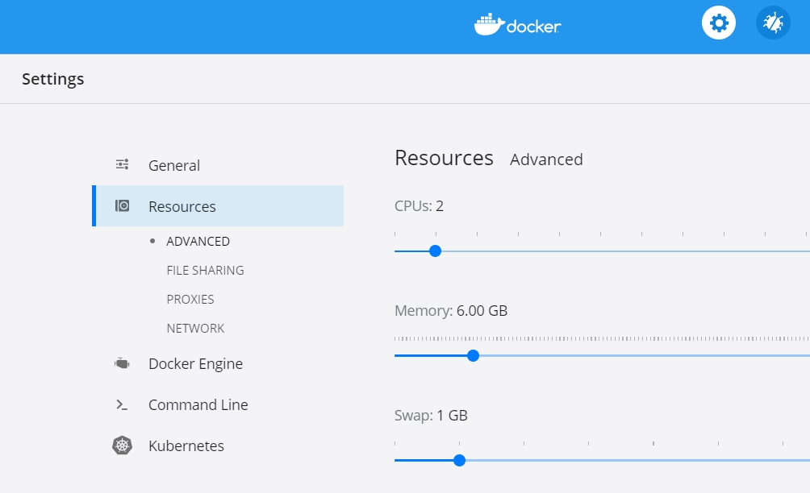
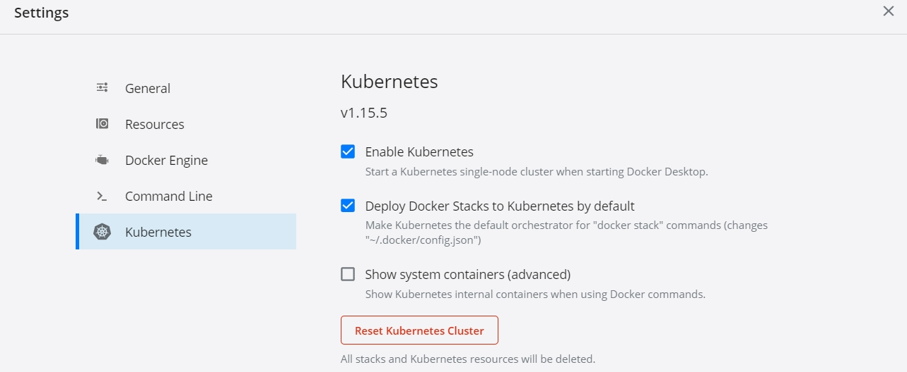

Various samples for webMethods Microservices Runtime and Istio for Service Mesh.

This project uses the Apache License Version 2.0. For details, see [the license file](LICENSE).

Important!
--

Many samples uses Docker images of webMethods Microservices Runtime published on Docker store. 

You need to agree to download webMethods Microservices Runtime Docker image from Docker store https://hub.docker.com/_/softwareag-webmethods-microservicesruntime. Use the username and password of your Docker Store account that you used to accept license for the webMethods Microservices Runtime Docker image in your Docker environment. i.e. make sure you use "docker login" command with the same username and password.

For more information about Microservices Runtime, see the official Software AG Microservices Runtime documentation.

Samples here provides detailed information about running webMethods Microservices Runtime with Istio. If using API Management, consider using [AppMesh](https://www.softwareag.com/us/products/api/appmesh/default.html) provided by for Software AG. 

It is expected that you have basic knowledge of Docker, Kubernetes, Istio for running these samples.

## To install and run the samples,
1. Ensure you have running Kubernetes setup. 

2. If you don't have Kubernetes setup, download Docker Desktop appropriate for your OS. In these samples, we used [Docker Desktop for Windows](https://hub.docker.com/editions/community/docker-ce-desktop-windows). 

3. If using Docker Desktop, ensure that you allocate at least 6 GB memory in the resources. This is required for reliable performing operations of Istio.

4. If using Docker Desktop, make sure you have enabled Kubernetes support. 

5. If using, Docker Desktop, ensure it is up and running. You will be required to start Docker Desktop with Administrator access.

6. Validate that Kubernetes and Docker is functioning okay in your environment. To do this, execute the following commands in a command prompt. For executing the below command as well any commands related to samples, you will need to launch command shell with Administrator access.

>docker ps -a
>docker images
>kubectl get namespace

If no errors are reported with the above commands, your setup is okay and execute rest of the samples demonstrating Istio with webMethods Microservices Runtime.

## Running samples,

There are multiple subsections demonstrating running Istio as a side car with webMethods Microservices Runtime. Follow each sections sequentially as there may be dependency in the execution of samples.

### Install Istio
As a first step, deploy Istio in your Kubernetes environment. Follow steps described in [Deploy Istio](00-install/README.md) section.

### Deploy BookInfo App
Once Istio is deployed, next step is to deploy sample BookInfo application in your environment. Follow steps described in [Deploy Istio](01-deploy/README.md) section.

### Fault tolerance
Follow steps described in [Fault  tolerance](02-traffic/README.md) section to identify how webMethods Microservices Runtime can be used with Istio for fault tolerance.

### Multiple versions of a service
Follow steps described in [versions](03-testing/README.md) section to deploy version v2 for one of the microservices and observe the pattern without using Istio.

### Canary Deployment
Follow steps described in [canary deployment](04-canary/README.md) section to identify how webMethods Microservices Runtime can be used with Istio for canary deployment.

### Network display with Kiali
[Kiali deployment](05-network-display-kiali/README.md) demonstrates integration with Kiali for display of service graphs.

### Open Tracing / Distributed Tracing with Jaeger
[Open tracing with Jaeger](06-jaeger/README.md) demonstrates integration with Jaeger for open tracing.

### Prometheus and Grafana 
[Deployment of Prometheus and Grafana services](07-Prometheus-Grafana/README.md) demonstrates integration with Prometheus and Grafana for visualization of Dashboards.

______________________
These tools are provided as-is and without warranty or support. They do not constitute part of the Software AG product suite. Users are free to use, fork and modify them, subject to the license agreement. While Software AG welcomes contributions, we cannot guarantee to include every contribution in the master project.	
_____________________
For more information you can Ask a Question in the [TECHcommunity Forums](http://tech.forums.softwareag.com/techjforum/forums/list.page?product=webmethods).

You can find additional information in the [Software AG TECHcommunity](http://techcommunity.softwareag.com/home/-/product/name/webmethods).
_______________________
Contact us at [TECHcommunity](mailto:technologycommunity@softwareag.com?subject=Github/SoftwareAG) if you have any questions.
